# CraveBook-App
CraveBook-App
<h1 align="center">🥪 CraveBook - Mobile App</h1>

**CraveBook** is a mobile recipe application built using React Native with Expo and JavaScript. Designed for food enthusiasts, it offers a clean and interactive way to explore and manage a growing collection of delicious recipes. The app currently features a curated set of custom dishes, with future plans to integrate live data through APIs.

---

## ✨ Features

### 📖 Browse Recipes
- Explore a curated list of delicious custom recipes.
- Tap any dish to view its **ingredients**, **steps**, and **preparation time**.

### 🔍 Search Recipes
- Use the built-in **search function** to find recipes by name, ingredient, or type.
- Quickly discover new dishes based on your cravings.

### 📝 Detailed Preparation Guide
- Each recipe includes step-by-step instructions for easy cooking.
- View all necessary ingredients and measurements in one place.

### 🍽️ Clean & Intuitive UI
- Smooth, mobile-friendly interface built with **React Native (Expo)**.
- Optimized for easy reading and quick interaction.

---

## 🛠️ Installation & Running

Clone this repository to your local machine:
```bash
    git clone https://github.com/deepanshubajaj/CraveBook-App.git
```
```bash
    npm install
```
```bash
    npx expo start
```

---

## 🎨 App Look

<p align="center">
  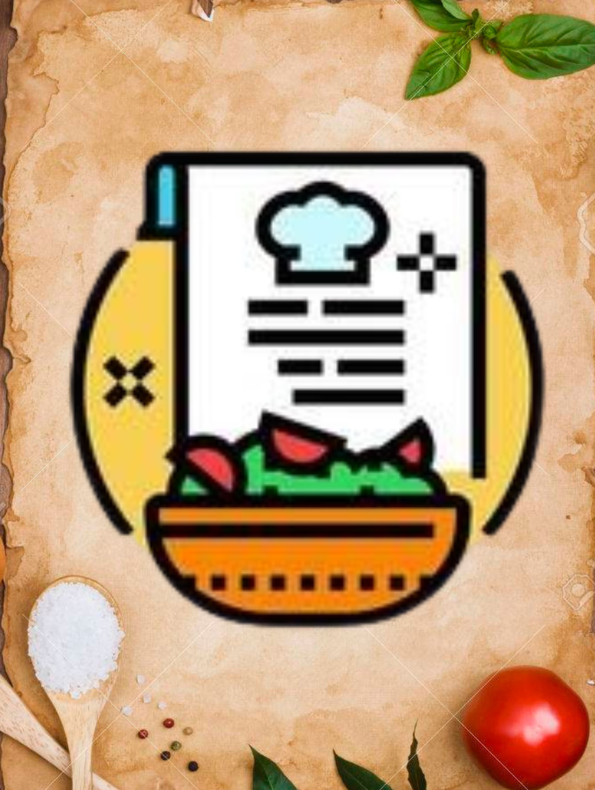
</p>
<p align="center">
  *App Icon.*
</p>

<p align="center">
  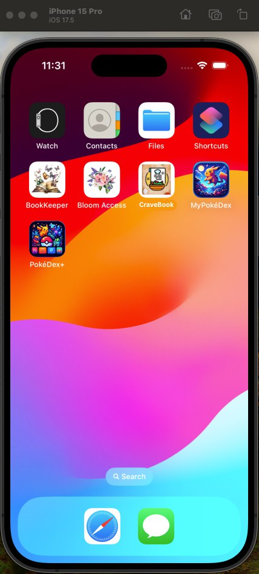
</p>
<p align="center">
  *App snapshot in the iOS simulator.*
</p>


---

### 🖼️ UI Sneak Peek

<p align="center">
  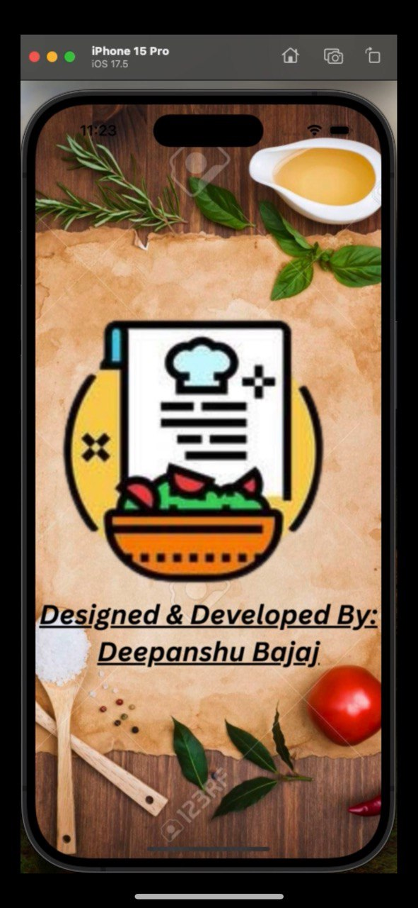
</p>
<p align="center">
  *Splash screen displayed upon app launch.*
</p>

<p align="center">
  <div style="display: flex; justify-content: center; gap: 10px;">
    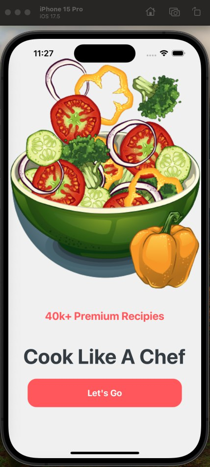
    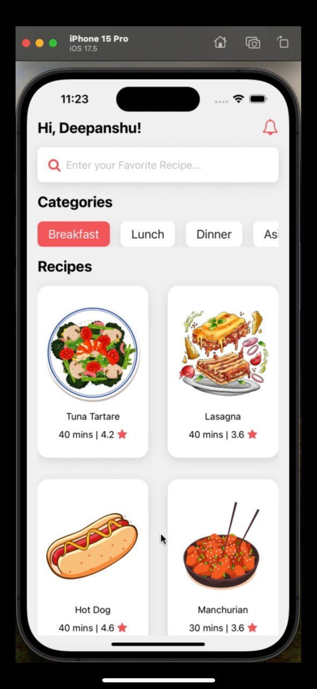
    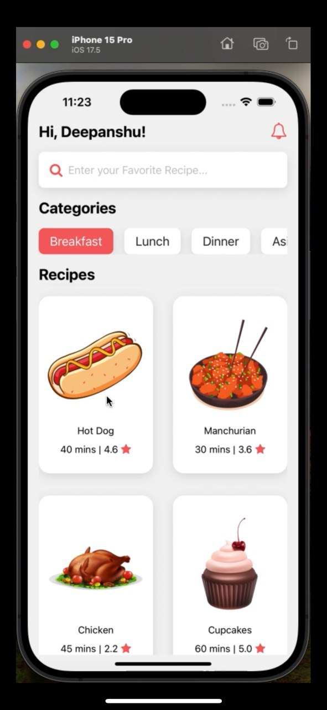
  </div>
</p>

<p align="center">
  <div style="display: flex; justify-content: center; gap: 10px;">
    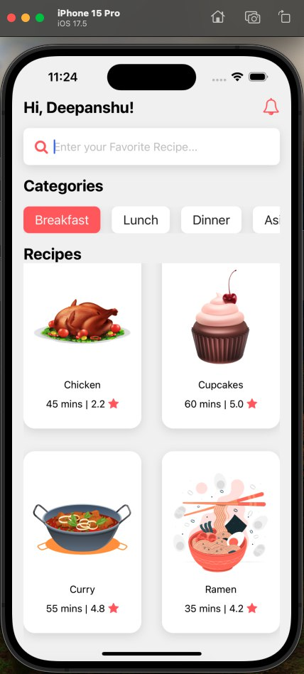
    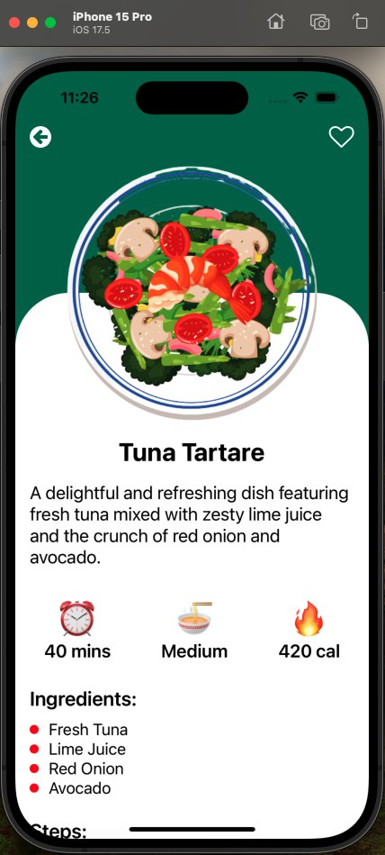
    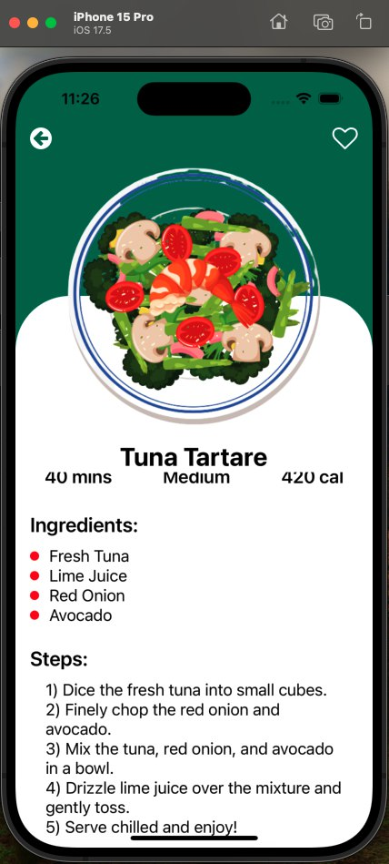
  </div>
</p>

<p align="center">
  <div style="display: flex; justify-content: center; gap: 10px;">
    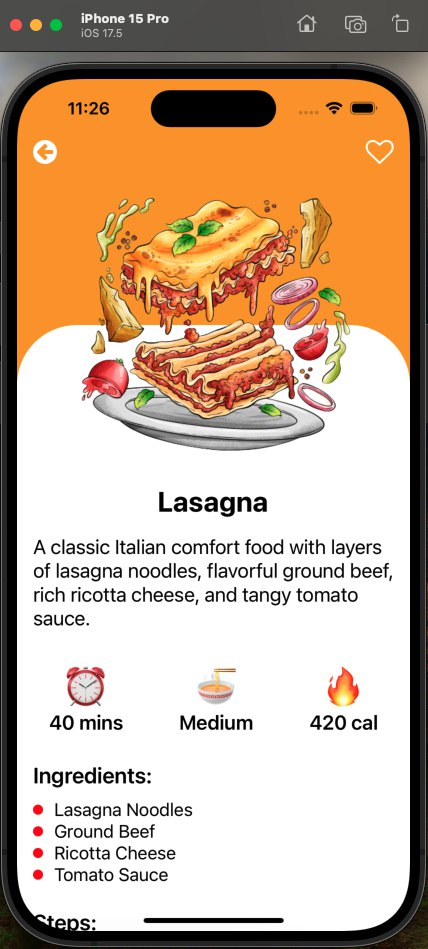
    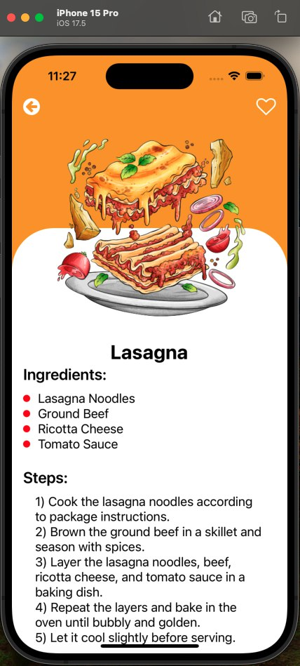
    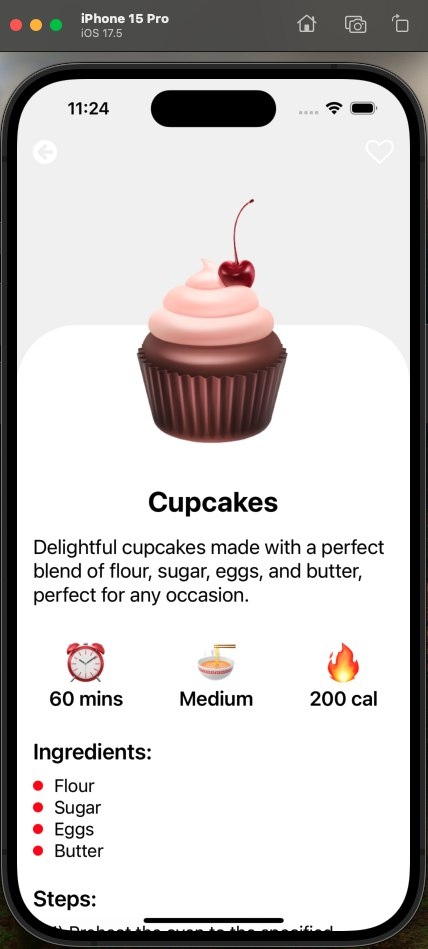
  </div>
</p>

<p align="center">
  <div style="display: flex; justify-content: center; gap: 10px;">
    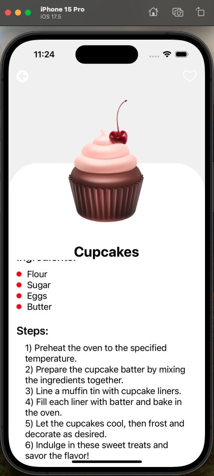
    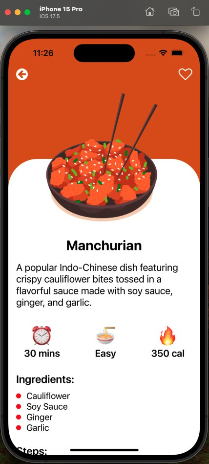
    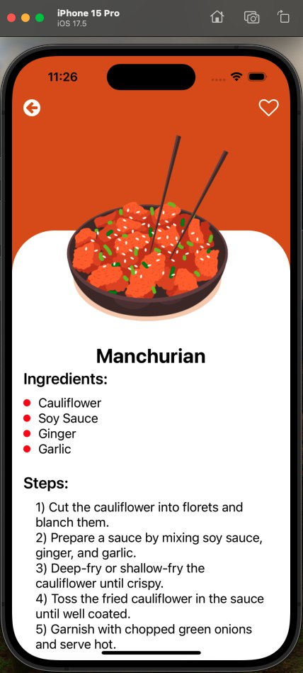
  </div>
</p>

<p align="center">
  <div style="display: flex; justify-content: center; gap: 10px;">
    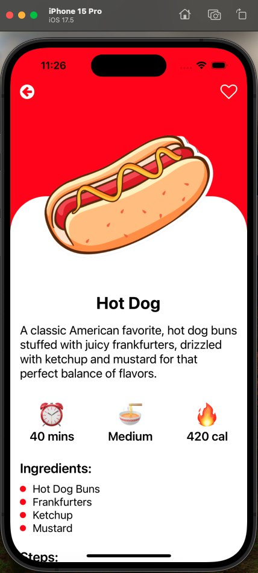
    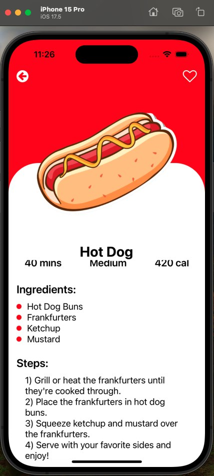
    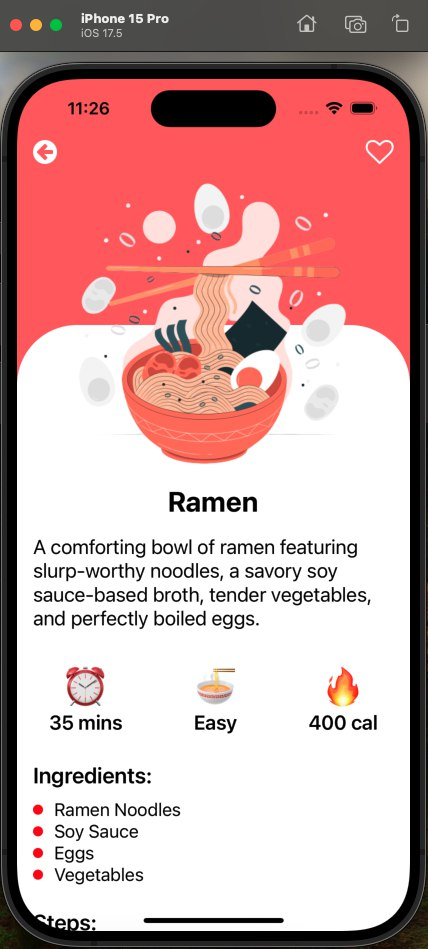
  </div>
</p>

<p align="center">
    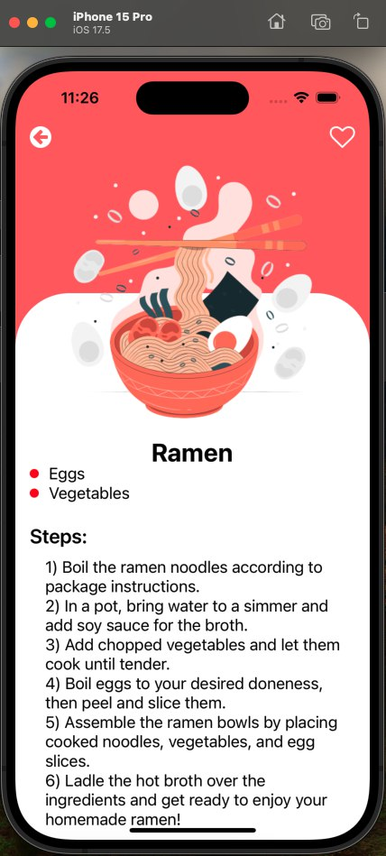
    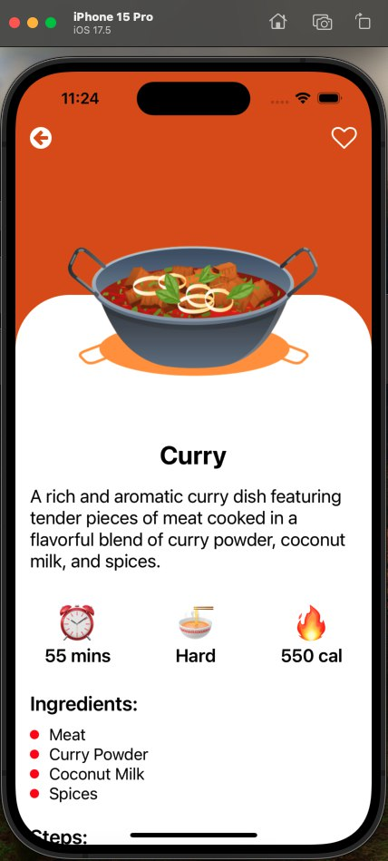
    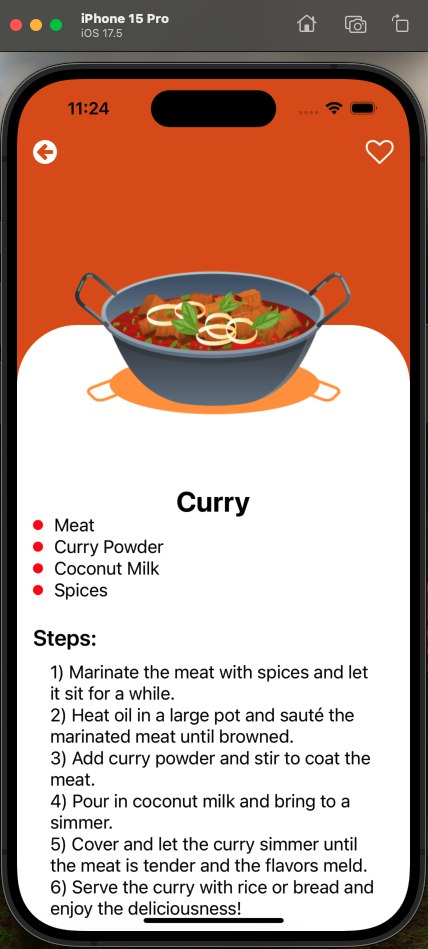
</p>

<p align="center">
  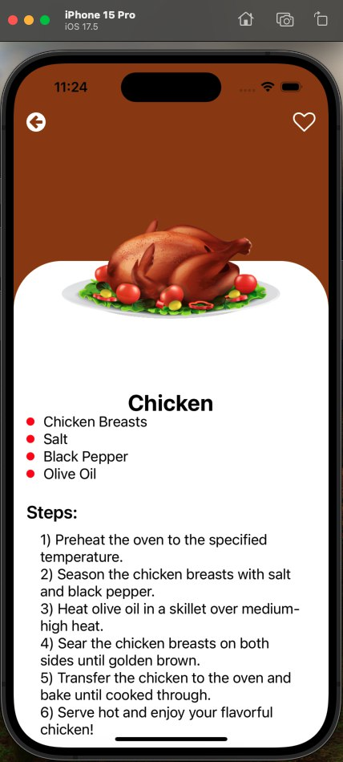
  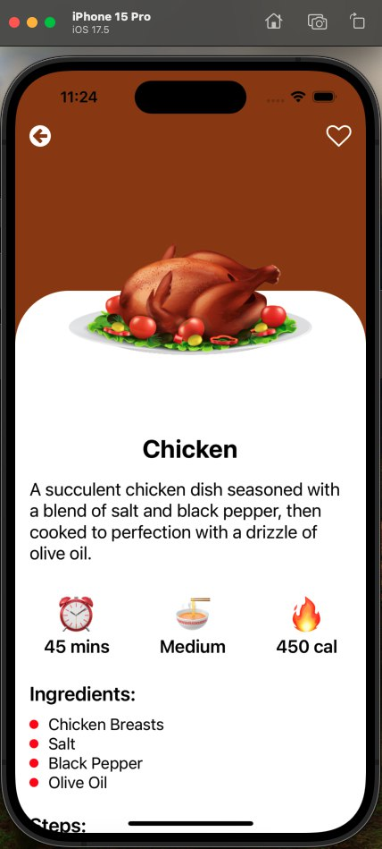
</p>


<p align="center">
  *Screenshots of the CraveBook App in iOS Showing different screens.*
</p>


---


## 🚀 Working App Demo

Here’s a short video showcasing the app's functionality:

<p align="center">
  
</p>

<p align="center">
  *Complete App Working Video.*
</p>

[🎥 Watch Complete Working Video](ProjectOutputs/WorkingVideo/WorkingVideoCompleteApp.mov)


---

## 🤝 Contributing

Thank you for your interest in contributing to this project!  
I welcome contributions from the community.

- You are free to use, modify, and redistribute this code under the terms of the MIT License.
- If you'd like to contribute, please **open an issue** or **submit a pull request**.
- All contributions will be reviewed and approved by the author — **[Deepanshu Bajaj](https://github.com/deepanshubajaj?tab=overview&from=2025-03-01&to=2025-03-31)**.

---

## 📃 License

This project is licensed under the [MIT License](./LICENSE).  
You are free to use this project for personal, educational, or commercial purposes — just make sure to provide proper attribution.

> **Clarification:** Commercial use includes, but is not limited to, use in products,  
> services, or activities intended to generate revenue, directly or indirectly.
